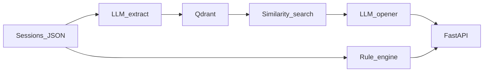

# System architecture (code layout)

This file is **how the prototype is built** (folders, data flow, stack). The PDF also asks for **design write-ups** that live in other files — see below.

## How this maps to the assessment brief

| PDF deliverable | What they want (in plain terms) | Where it lives in this repo |
|-----------------|----------------------------------|-----------------------------|
| **1 — Memory architecture** | What you save, why; fast retrieval at session start; privacy / user control; what you refuse to store | Mostly **`docs/memory_architecture.md`** (schema, retrieval, “not stored”, user control). This file’s diagram + “Ingest vs chat” only **summarizes** that. |
| **2 — Working prototype** | Ingest sessions, structured memories, warm opener (not a data dump) | **`src/`**, **`sessions/`**, **`gradio_app.py`**, **`README.md`** setup |
| **3 — Re-engagement rules** | When to nudge; 3 example notifications | **`src/reengagement.py`** + narrative in **`README.md`** / docs if any |
| **4 — Ethical risks** | Top risks, mitigations, what to flag clinically | **`docs/ethical_risk_analysis.md`** |

So: **`architecture.md` alone does not replace the 1–2 page memory design doc** — pair it with **`docs/memory_architecture.md`** for Deliverable 1.

## Bird’s-eye view

Data lives in `sessions/`. The API and Gradio both call into `src/memory_pipeline.py` for the heavy lifting.

## Main modules

**`src/config.py`** — `.env` → settings. `get_settings()` is cached so we’re not re-parsing the file on every request.

**`src/models.py`** — Pydantic models for sessions, profile, API requests. `infer_mood_score()` is a dumb keyword scan on the closing tone string; it’s only there to feed the re-engagement rules something numeric.

**`src/memory_pipeline.py`** — The spine. Loads JSON, runs extraction with structured output, writes to Qdrant. Point IDs are UUIDs because the Qdrant build I hit didn’t like arbitrary strings. `count_stored_memories()` exists so the Gradio app can skip re-ingesting everything on every message (that was making chat stupid slow).

**`src/reengagement.py`** — If/else on days since last session, rough mood, unresolved themes. Plus three canned examples for the write-up. Not ML.

**`src/main.py`** — Thin FastAPI wrapper. 404 if `user_id` doesn’t match the profile file (there’s only one user in the sample data anyway).

**`gradio_app.py`** — Sidebar markdown from JSON + chat that retrieves memories per turn. “Prepare memories” / warm opener buttons for demos.

## Ingest vs chat

Ingest: N sessions → N LLM calls for extraction → embed each memory → upsert. Chat: one embed for the query, one LLM call for the reply (after we stopped re-running ingest every time).

## Stack choices

FastAPI because it’s quick. LangChain because `with_structured_output` saved me from writing JSON repair glue. Qdrant because it’s straightforward locally. Pydantic because the sample JSON isn’t perfectly uniform and I didn’t want silent key errors.

DeepSeek first for chat (memory extraction + openers + Gradio replies) via `ChatOpenAI` + `base_url`, with LangChain `with_fallbacks` to OpenAI chat on provider/HTTP/parse failures. OpenAI also handles embeddings into Qdrant.
